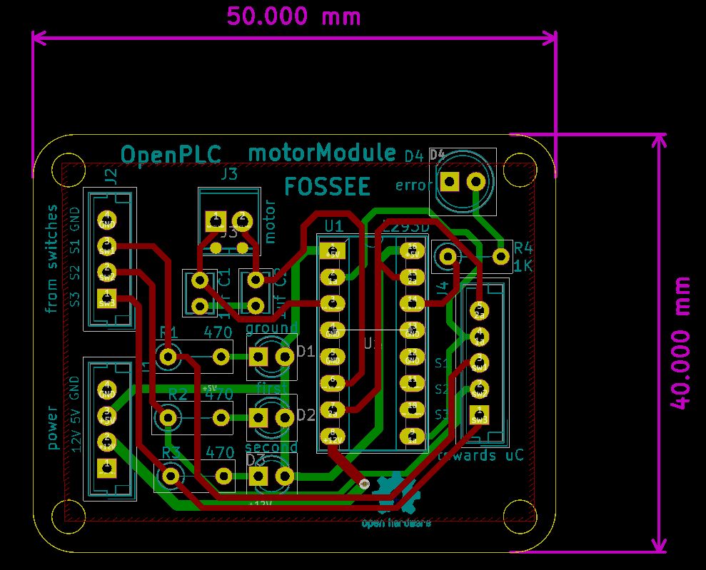

# OpenPLC Modules

Addon modules for OpenPLC experiments.
- Traffic light - represent a 3 way traffic light 
- Motor driver for lift - circuit required for driving the motor, receiving and passing on the limit-switch state and as an indicator showing the given logic 
- Heater/temperature control - elements to drive the roister, which also doubles as the heating element, the cooling fan and collecting and passing on thermistor values 
- Switches - an array of a combination of NO, NC and latch switches with indicator LEDs 
